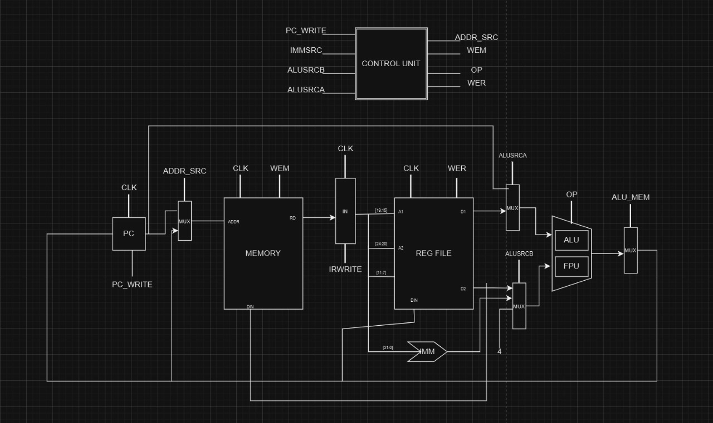

# MULTI-CYCLE-RISCV

# RISC-V Instruction Formats and Set

This repository provides an overview of RISC-V instruction formats and the corresponding instruction set categorized by their respective formats. It serves as a quick reference for understanding the RISC-V ISA.

## Instruction Formats

The RISC-V instruction set is classified into six formats:

1. **R-Type (Register-Register)**
   - Used for arithmetic and logical operations with three register operands.
   - **Fields:**
     - `opcode` (7 bits): Basic operation code.
     - `rd` (5 bits): Destination register.
     - `funct3` (3 bits): Sub-operation code.
     - `rs1` (5 bits): Source register 1.
     - `rs2` (5 bits): Source register 2.
     - `funct7` (7 bits): Additional sub-operation code.

2. **I-Type (Immediate)**
   - Used for instructions with immediate values, memory loads, and control flow.
   - **Fields:**
     - `opcode` (7 bits): Basic operation code.
     - `rd` (5 bits): Destination register.
     - `funct3` (3 bits): Sub-operation code.
     - `rs1` (5 bits): Source register 1.
     - `imm` (12 bits): Immediate value.

3. **S-Type (Store)**
   - Used for store instructions.
   - **Fields:**
     - `opcode` (7 bits): Basic operation code.
     - `imm[4:0]` (5 bits): Lower bits of the immediate value.
     - `funct3` (3 bits): Sub-operation code.
     - `rs1` (5 bits): Source register 1.
     - `rs2` (5 bits): Source register 2.
     - `imm[11:5]` (7 bits): Upper bits of the immediate value.

4. **B-Type (Branch)**
   - Used for conditional branching.
   - **Fields:**
     - `opcode` (7 bits): Basic operation code.
     - `imm` (13 bits): Formed by combining multiple fields:
       - `imm[12]`, `imm[10:5]`, `imm[4:1]`, and `imm[11]`.

5. **U-Type (Upper Immediate)**
   - Used to set the upper 20 bits of a register.
   - **Fields:**
     - `opcode` (7 bits): Basic operation code.
     - `rd` (5 bits): Destination register.
     - `imm[31:12]` (20 bits): Upper immediate value.

6. **J-Type (Jump)**
   - Used for unconditional jumps.
   - **Fields:**
     - `opcode` (7 bits): Basic operation code.
     - `rd` (5 bits): Destination register.
     - `imm` (21 bits): Formed by combining:
       - `imm[20]`, `imm[10:1]`, `imm[11]`, and `imm[19:12]`.

## Instruction Set

The following is a categorized list of instructions under each format:

### 1. R-Type Instructions
| Instruction | Description               | Opcode   | funct3 | funct7   |
|-------------|---------------------------|----------|--------|----------|
| add         | Add                       | 0110011  | 000    | 0000000  |
| sub         | Subtract                  | 0110011  | 000    | 0100000  |
| sll         | Shift left logical        | 0110011  | 001    | 0000000  |
| slt         | Set less than             | 0110011  | 010    | 0000000  |
| sltu        | Set less than unsigned    | 0110011  | 011    | 0000000  |
| xor         | Exclusive OR              | 0110011  | 100    | 0000000  |
| srl         | Shift right logical       | 0110011  | 101    | 0000000  |
| sra         | Shift right arithmetic    | 0110011  | 101    | 0100000  |
| or          | OR                        | 0110011  | 110    | 0000000  |
| and         | AND                       | 0110011  | 111    | 0000000  |

### 2. I-Type Instructions
| Instruction | Description                 | Opcode   | funct3 |
|-------------|-----------------------------|----------|--------|
| addi        | Add immediate              | 0010011  | 000    |
| slti        | Set less than immediate    | 0010011  | 010    |
| sltiu       | Set less than immediate unsigned | 0010011  | 011    |
| xori        | XOR immediate              | 0010011  | 100    |
| ori         | OR immediate               | 0010011  | 110    |
| andi        | AND immediate              | 0010011  | 111    |
| slli        | Shift left logical immediate | 0010011  | 001  |
| srli        | Shift right logical immediate | 0010011  | 101  |
| srai        | Shift right arithmetic immediate | 0010011  | 101 |
| jalr        | Jump and link register     | 1100111  | 000    |
| lb          | Load byte                  | 0000011  | 000    |
| lh          | Load halfword              | 0000011  | 001    |
| lw          | Load word                  | 0000011  | 010    |
| lbu         | Load byte unsigned         | 0000011  | 100    |
| lhu         | Load halfword unsigned     | 0000011  | 101    |

### 3. S-Type Instructions
| Instruction | Description | Opcode   | funct3 |
|-------------|-------------|----------|--------|
| sb          | Store byte  | 0100011  | 000    |
| sh          | Store halfword | 0100011 | 001   |
| sw          | Store word  | 0100011  | 010    |

### 4. B-Type Instructions
| Instruction | Description             | Opcode   | funct3 |
|-------------|-------------------------|----------|--------|
| beq         | Branch if equal         | 1100011  | 000    |
| bne         | Branch if not equal     | 1100011  | 001    |
| blt         | Branch if less than     | 1100011  | 100    |
| bge         | Branch if greater or equal | 1100011 | 101   |
| bltu        | Branch if less than unsigned | 1100011 | 110 |
| bgeu        | Branch if greater or equal unsigned | 1100011 | 111 |

### 5. U-Type Instructions
| Instruction | Description               | Opcode   |
|-------------|---------------------------|----------|
| lui         | Load upper immediate      | 0110111  |
| auipc       | Add upper immediate to PC | 0010111  |

### 6. J-Type Instructions
| Instruction | Description   | Opcode   |
|-------------|---------------|----------|
| jal         | Jump and link | 1101111  |

## License
This repository is open-source and licensed under the [MIT License](LICENSE).

## Acknowledgements
- RISC-V Specifications: [RISC-V Official Website](https://riscv.org/)
